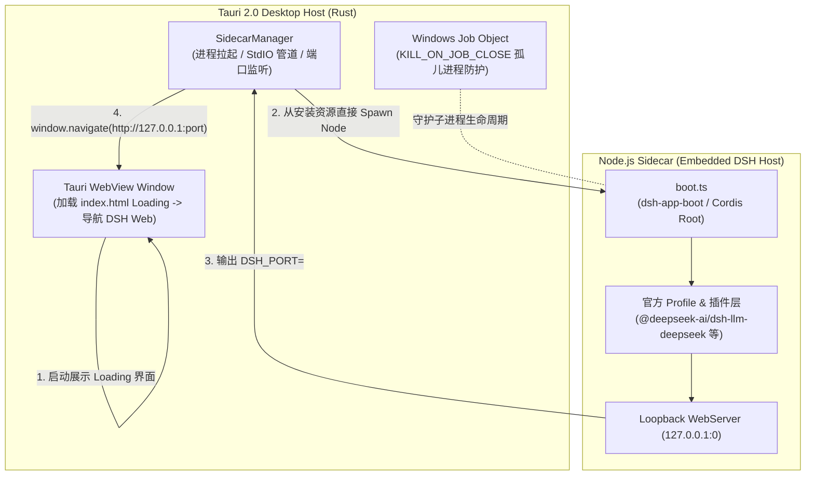

# DeepSeek Harness GUI

<div align="center">


**基于 Tauri 2.0 + 官方 `@deepseek-ai/dsh` 引擎打造的跨平台极薄桌面客户端**

[](https://tauri.app/)
[](https://www.rust-lang.org/)
[](https://nodejs.org/)
[](https://platform.deepseek.com/)
[](./LICENSE)

[English](#-disclaimer) | [简体中文](#-免责声明)

</div>

---

### ⚠️ 免责声明 / Disclaimer

> [!IMPORTANT]
> **中文**：本项目为独立开源社区开发的桌面客户端工具，**并非 DeepSeek（深度求索）官方产品，亦未获得官方背书或授权**。所有 DeepSeek 及 DeepSeek Harness 相关的名称、徽标和商标均属于其各自所有者（杭州深度求索人工智能基础技术研究有限公司）。本项目仅提供原生桌面外壳交互与环境打包分发。
>
> **English**: This project is an independent, community-driven desktop client. It is **NOT** an official product of DeepSeek, nor is it affiliated with, sponsored, or endorsed by DeepSeek AI. All trademarks, service marks, and company names are the property of their respective owners.

---

## 📖 项目简介

**DeepSeek Harness GUI** 是一款为 [DeepSeek Harness (DSH)](https://github.com/deepseek-ai/deepseek-harness) 量身打造的桌面端原生客户端。

客户端采用 **Rust (Tauri v2) + 独立 Node.js Sidecar** 的架构设计，将官方 DSH 引擎（`@deepseek-ai/dsh`）以内嵌库的形式在本地 Loopback 端口拉起，并通过系统原生 WebView 呈现官方交互界面，兼具原生桌面应用的极致轻量体验与官方智能体引擎的强大扩展能力。

---

## ✨ 核心特性

- 🚀 **极薄原生宿主**：基于 Tauri 2.0 构建原生外壳，不内置臃肿的 Chromium；引擎由安装器预先展开的 Sidecar 与 Node 22 LTS 承载，开箱极速启动。
- 📦 **免配环境，开箱即用**：安装包内嵌独立 Node.js 运行时与完整 Sidecar 生产闭包，最终用户**无需预装 Node.js、Rust 或手动配置命令行环境**。
- 🤖 **完整官方 DSH 引擎**：以库模式启动官方 `dsh-base` + `dsh-web-app` Profile，享受官方实时更新的智能体生态与全套工具支持。
- 🎨 **现代白阶视觉体验**：纯白微光主题启动 Loading、DeepSeek 高清矢量徽标与全尺寸视网膜图标集。
- 🛡️ **进程生命周期与防孤儿守护**：
  - **Windows Job Object**：宿主进程意外退出或崩溃时，操作系统内核级自动级联销毁 Sidecar 子进程，杜绝后台残留。
  - **Stdin/Stdout 看门狗**：管道断开自动触发优雅停机。
- 🔒 **纯净与安全隔离**：
  - 本地回环（`127.0.0.1:0`）随机端口绑定，不对公网暴露服务。
  - 客户端零硬编码密钥，用户 API Key 均独立保存在个人用户目录（`~/.dsh/`），安全隔离。

---

## 🏛️ 架构设计



---

## 📁 目录结构

```text
deepseek-harness-gui/
├── src-tauri/                 # Tauri 宿主核心工程 (Rust)
│   ├── src/                   # Rust 源码 (lib.rs 入口, sidecar 管理器, IPC 通信)
│   ├── icons/                 # 全平台各尺寸应用图标 (ico, icns, png)
│   ├── resources/             # 打包资源目录（自动生成 Sidecar 生产闭包与 Node 22）
│   ├── tauri.conf.json        # Tauri 应用配置
│   └── Cargo.toml             # Rust 依赖配置
├── sidecar/                   # Node.js Sidecar 引擎工程 (TypeScript)
│   ├── src/                   # Sidecar 启动器 (boot.ts) 与服务挂载
│   ├── patches/               # 官方上游依赖补丁
│   └── package.json           # DSH 官方依赖与工具链
├── scripts/                   # 自动化构建与许可证脚本
│   └── bundle-sidecar.js      # Sidecar 生产闭包与 Node 22 运行时组装脚本
├── index.html                 # 客户端启动 Loading 页面 (纯白极简动效)
├── app-icon.svg               # 1024x1024 高清矢量主图标
├── package.json               # 根工程构建脚本
└── .gitignore                 # 标准 Git 忽略规则
```

---

## 🛠️ 本地开发与构建

### 1. 平台支持范围

- **Windows 10/11 x64**：NSIS 安装包
- **macOS 12+ (Intel / Apple Silicon)**：DMG 镜像
- **Ubuntu 22.04+ x64**：支持源码构建与 CI 验证；当前发布页暂不提供 Linux 安装包

### 2. 环境准备

- **Node.js**：`>= 22.19.0`
- **pnpm**：`>= 11.9.0`
- **Rust 工具链**：`stable` (含 `cargo`)
- **系统依赖**：
  - Windows: Visual Studio C++ Build Tools & WebView2
  - macOS: Xcode Command Line Tools
  - Linux (Ubuntu/Debian): `sudo apt-get install libwebkit2gtk-4.1-dev libappindicator3-dev librsvg2-dev patchelf libssl-dev build-essential`

### 3. 安装依赖与构建

```bash
# 1. 安装根目录与 Sidecar 依赖
npm ci
cd sidecar && pnpm install --frozen-lockfile && cd ..

# 2. 编译前端与打包 Sidecar 闭包
npm run build:all

# 3. 运行本地开发调试
npm run tauri dev
```

### 4. 生成发行安装包

```bash
# 步骤 1: 准备完整闭包与许可证
npm run build:all

# 步骤 2: 生成当前系统平台的安装包
npx tauri build
```

打包完成后，各平台产物位于 `src-tauri/target/release/bundle/`：
- **🪟 Windows**：`nsis/DeepSeek Harness GUI_*_x64-setup.exe`
- **🍎 macOS**：`dmg/DeepSeek Harness GUI_*_aarch64.dmg` / `x64.dmg`
- **🐧 Linux**：当前需从源码执行 `npx tauri build`，自动发布安装包将在打包兼容性稳定后恢复

---

## 🔑 API Key 配置说明

本安装包为**纯净安全版**，未内置任何个人密钥。用户安装并初次启动后，可通过以下方式配置自己的 DeepSeek API Key：

1. **界面配置（推荐）**：
   在客户端界面点击 **设置 (Settings)** -> 找到 API Key 配置项，填入您的 `sk-xxxxxxxxxxxxxxxxxxxxxxxx` 即可。
2. **系统环境变量**：
   在操作系统中添加环境变量：
   ```bash
   DEEPSEEK_API_KEY="sk-xxxxxxxxxxxxxxxxxxxxxxxx"
   ```

*所有配置均保存在使用者本地电脑的 `~/.dsh/` 目录下，安全独立。*

---

## 🔐 安全模型与注意事项

- **仅 Loopback 暴露**：DSH 引擎绑定 `127.0.0.1` 随机端口，不对公网开放。
- **零硬编码密钥**：安装包不含任何 API Key，凭据由引擎保存在用户目录 `~/.dsh/`。
- **Sidecar 生命周期守护**：Windows Job Object（`KILL_ON_JOB_CLOSE`）+ stdin/stdout 看门狗，双重防孤儿进程。
- **⚠️ 本机威胁模型**：Loopback Web 服务无鉴权令牌，**本机任意进程均可连接该端口并驱动 Agent**。请只在可信机器上运行。

完整安全策略见 [SECURITY.md](./SECURITY.md)。

---

## 🤝 社区贡献与协作
 
欢迎参与社区建设！提交代码或反馈问题前请参阅 [CONTRIBUTING.md](./CONTRIBUTING.md)。
- 提交前请务必保证本地 `npm run build:all`、`cargo test` 与 `npm run licenses:check` 全部通过。
- 涉及重大特性变更请先在 Issue 中交流讨论。

---

## 📄 开源许可证

本项目基于 [MIT License](./LICENSE) 开源。第三方依赖许可证清单请参阅 [THIRD_PARTY_LICENSES.txt](./THIRD_PARTY_LICENSES.txt)。
