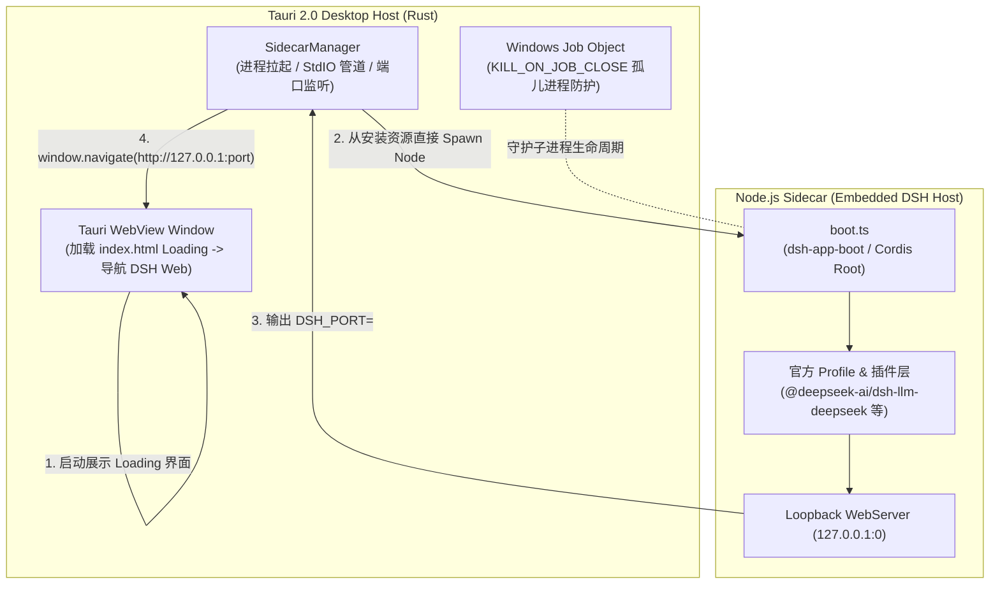

# DeepSeek Harness Desktop

<div align="center">


**基于 Tauri 2.0 + 官方 `@deepseek-ai/dsh` 引擎打造的跨平台极薄桌面客户端**

[](https://tauri.app/)
[](https://www.rust-lang.org/)
[](https://nodejs.org/)
[](https://platform.deepseek.com/)
[](./LICENSE)

</div>

---

## 📖 项目简介

**DeepSeek Harness Desktop** 是一款为 [DeepSeek Harness (DSH)](https://github.com/deepseek-ai/deepseek-harness) 量身打造的桌面端原生客户端。

> 本项目是独立社区项目，并非 DeepSeek AI 官方产品，也未获得其背书。正式安装包仅通过本仓库 GitHub Releases 发布。

客户端采用 **Rust (Tauri v2) + 独立 Node.js Sidecar** 的架构设计，将官方 DSH 引擎（`@deepseek-ai/dsh`）以内嵌库的形式在本地 Loopback 端口拉起，并通过 WebView 呈现官方交互界面，兼具原生桌面应用的流畅体验与官方智能体引擎的强大扩展能力。

---

## ✨ 核心特性

- 🚀 **极薄宿主**：基于 Tauri 2.0 构建原生外壳，不内置 Chromium；引擎由安装器预先展开的 Sidecar 与 Node 22 LTS 承载，首次启动不再解压依赖。
- 📦 **开箱即用，免配环境**：安装包内嵌独立 Node.js 运行时与完整 Sidecar 生产闭包，最终用户**无需预装 Node.js、Rust 或手动更新依赖**。
- 🤖 **完整官方 DSH 引擎**：以库模式启动官方 `dsh-base` + `dsh-web-app` Profile，享受官方实时更新的智能体生态与全套工具支持。
- 🎨 **现代白阶视觉体验**：全新设计的纯白微光主题启动 Loading、官方 DeepSeek 高清矢量徽标与全尺寸视网膜图标集。
- 🛡️ **进程生命周期与防孤儿守护**：
  - **Windows Job Object**：宿主进程意外退出或崩溃时，操作系统内核级自动级联销毁 Sidecar 子进程，杜绝后台残留。
  - **Stdin/Stdout 看门狗**：管道断开自动触发优雅停机。
- 🔒 **纯净与安全隔离**：
  - 本地回环（`127.0.0.1:0`）随机端口绑定，不对公网暴露服务。
  - 客户端零硬编码密钥，用户 API Key 均独立保存在个人用户目录（`~/.dsh/`），安全隔离。

---

## 🏛️ 架构设计



---

## 📁 目录结构

```text
harness-agent/
├── src-tauri/                 # Tauri 宿主核心工程 (Rust)
│   ├── src/                   # Rust 源码 (lib.rs 入口, sidecar 管理器, IPC 通信)
│   ├── icons/                 # 全平台各尺寸应用图标 (ico, icns, png)
│   ├── resources/             # 打包资源目录（自动生成 Sidecar 生产闭包与 Node 22）
│   ├── tauri.conf.json        # Tauri 应用配置
│   └── Cargo.toml             # Rust 依赖配置
├── sidecar/                   # Node.js Sidecar 引擎工程 (TypeScript)
│   ├── src/                   # Sidecar 启动器 (boot.ts) 与服务挂载
│   ├── patches/               # 官方上游依赖补丁
│   └── package.json           # DSH 官方依赖与工具链
├── scripts/                   # 自动化构建脚本
│   └── bundle-sidecar.js      # Sidecar 生产闭包与 Node 22 运行时组装脚本
├── index.html                 # 客户端启动 Loading 页面 (纯白极简动效)
├── app-icon.svg               # 1024x1024 高清矢量主图标
├── package.json               # 根工程构建脚本
└── .gitignore                 # 标准 Git 忽略规则
```

---

## 🛠️ 本地开发与构建

## ✅ 正式支持范围

- Windows 10/11 x64：NSIS
- macOS 12+ Intel / Apple Silicon：签名并公证的 DMG
- Ubuntu 22.04+ x64：AppImage、deb

Windows ARM64、Linux ARM64、MSI 与 rpm 当前不属于正式支持范围。稳定版安装包必须通过签名、安装、首次启动、二次启动和自动升级门禁；未完成门禁的构建统一标记为 Preview。

### 1. 环境准备

- **Node.js**：`>= 22.19.0` 或 `>= 24.0.0`
- **pnpm**：`>= 9.0.0`
- **Rust 工具链**：`stable` (含 `cargo`)
- **构建工具**：
  - Windows: C++ Build Tools (Visual Studio)
  - macOS: Xcode Command Line Tools (`xcode-select --install`)
  - Linux (Ubuntu/Debian): `sudo apt-get install libwebkit2gtk-4.1-dev libappindicator3-dev librsvg2-dev patchelf libssl-dev build-essential`

### 2. 安装依赖

```bash
# 根目录安装前端与 Tauri CLI 依赖
npm install

# 安装 Sidecar 子工程依赖
cd sidecar && pnpm install && cd ..
```

### 3. 开发模式调试

```bash
# 启动本地开发服务 (支持前端热重载与 Sidecar 调试)
npm run tauri dev
```

### 4. 本地全量打包

```bash
# 步骤 1: 编译前端 + 组装 Sidecar 生产闭包与 Node 22 运行时
npm run build:all

# 步骤 2: 生成当前平台的安装包
npx tauri build
```

打包完成后，各平台产物位于 `src-tauri/target/release/bundle/`：
- **🪟 Windows**：`nsis/DeepSeek Harness_*_x64-setup.exe`
- **🍎 macOS**：`dmg/DeepSeek Harness_*_aarch64.dmg` / `x64.dmg`
- **🐧 Linux**：`appimage/deepseek-harness_*.AppImage` / `deb/deepseek-harness_*.deb`

---

## 🌐 自动化多端发布 (GitHub Actions)

本项目已配置完整的全平台 CI/CD 自动化流水线（`.github/workflows/release.yml`）。无需本地配置 Mac 或 Linux 环境，即可通过 GitHub 自动编译发布所有平台的安装包：

```bash
# 打上版本 Tag 并推送到 GitHub，自动触发 Windows、macOS (Apple Silicon/Intel)、Linux 云端构建
git tag v0.1.4
git push origin v0.1.4
```

构建完成后，GitHub Releases 将自动生成并挂载各平台安装包供直接下载。

---

## 🔑 API Key 配置说明

本安装包为**纯净安全版**，未内置任何个人密钥。用户安装并初次启动后，可通过以下方式配置自己的 DeepSeek API Key：

1. **界面配置（推荐）**：
   在客户端界面点击 **设置 (Settings)** -> 找到 API Key 配置项，填入您的 `sk-xxxxxxxxxxxxxxxxxxxxxxxx` 即可。
2. **系统环境变量**：
   在操作系统中添加环境变量：
   ```bash
   DEEPSEEK_API_KEY="sk-xxxxxxxxxxxxxxxxxxxxxxxx"
   ```

*配置保存在使用者本地电脑的 `~/.dsh/` 目录下，互不影响。*

---

## 🔐 安全模型与注意事项

- **仅 Loopback 暴露**：DSH 引擎绑定 `127.0.0.1` 随机端口，不对公网开放。
- **零硬编码密钥**：安装包不含任何 API Key，凭据由引擎保存在用户目录 `~/.dsh/`。
- **Sidecar 生命周期守护**：Windows Job Object（`KILL_ON_JOB_CLOSE`）+ stdin/stdout 看门狗，双重防孤儿进程。
- **⚠️ 本机威胁模型**：Loopback Web 服务无鉴权令牌，**本机任意进程均可连接该端口并驱动 Agent**。请只在可信机器上运行。

完整安全策略见 [SECURITY.md](./SECURITY.md)。

## 🩺 日志与故障诊断

应用默认只写本地结构化日志，不上传遥测、崩溃、提示词或会话。通过原生菜单“帮助与诊断”可以打开日志目录、复制脱敏摘要、导出诊断 ZIP 或检查签名更新。日志最多保留 14 天且总量不超过 100 MiB。

诊断包只包含应用版本、平台、启动阶段、耗时与近期脱敏日志，不包含 `~/.dsh` 设置、API Key、会话或工作区文件。提交 Issue 前仍请人工检查诊断包。应用数据位于系统为 `io.github.fuqiangchen.harness-agent` 分配的 App Data/Log 目录；DSH 用户数据继续位于 `~/.dsh/`。

若应用停留在启动页：

1. 点击“导出诊断包”。
2. 确认包内没有个人信息。
3. 使用 Installation problem 模板提交平台、安装包格式和诊断摘要。

---

## ™️ 商标声明

DeepSeek、DeepSeek Harness 及相关名称、徽标是 DeepSeek AI 的商标。本项目为社区独立实现的第三方桌面客户端，与 DeepSeek AI 无关联，未获其官方背书。官方引擎 `@deepseek-ai/dsh*` 以 MIT 许可证开源。

---

## 📄 开源许可证

本项目基于 [MIT License](./LICENSE) 开源。
